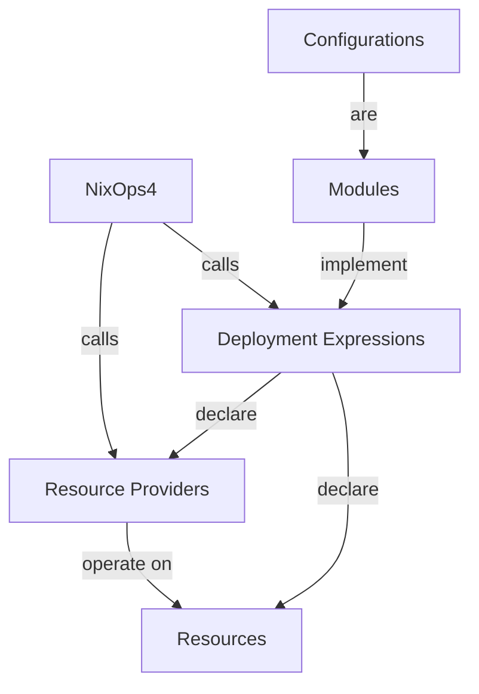
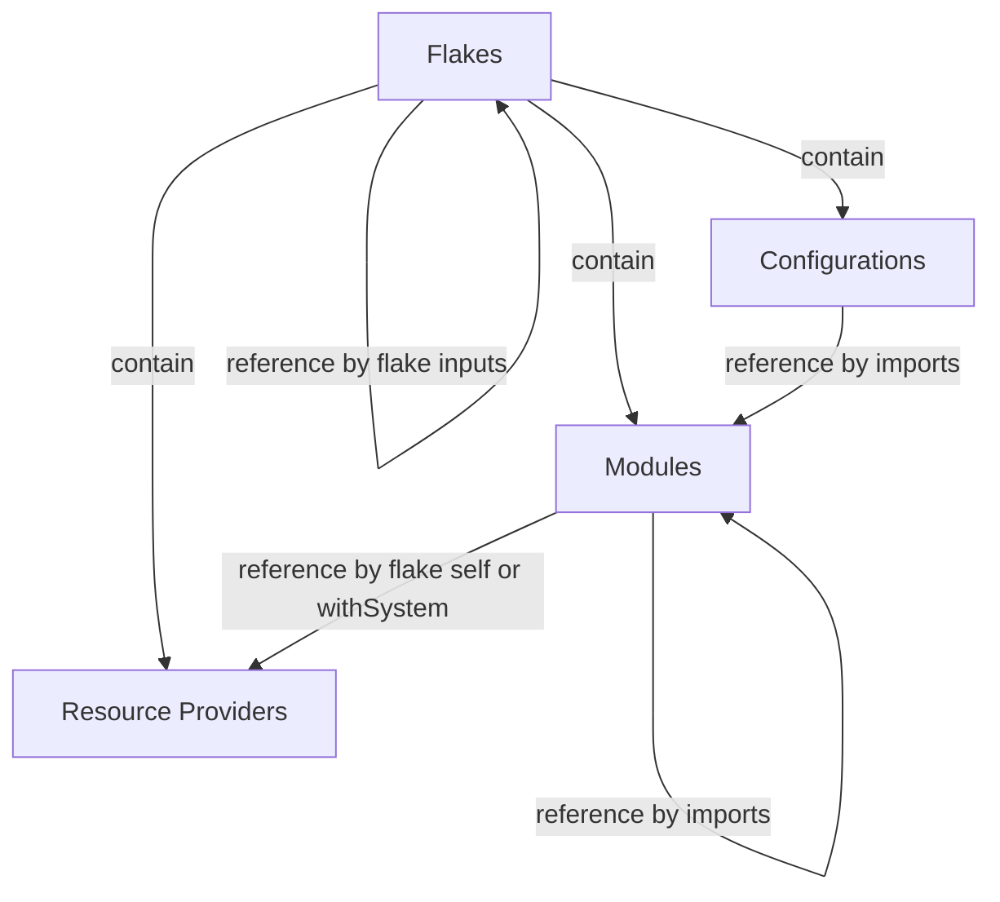

# NixOps4 Components

<!--
  TODO use mermaid block diagram when out of beta?
  https://mermaid.js.org/syntax/block.html
-->

## Overview

This shows the main types of components that exist around NixOps4.

## Nix Expressions

Any node can reference packages.

## Crate Structure

NixOps4 is implemented in Rust, and it links to the [Nix package manager](https://nix.dev/manual/nix/latest) to integrate with the Nix language and store.

It is composed of the following Rust crates:

{{#include ./cargo-deps.gen.md}}

